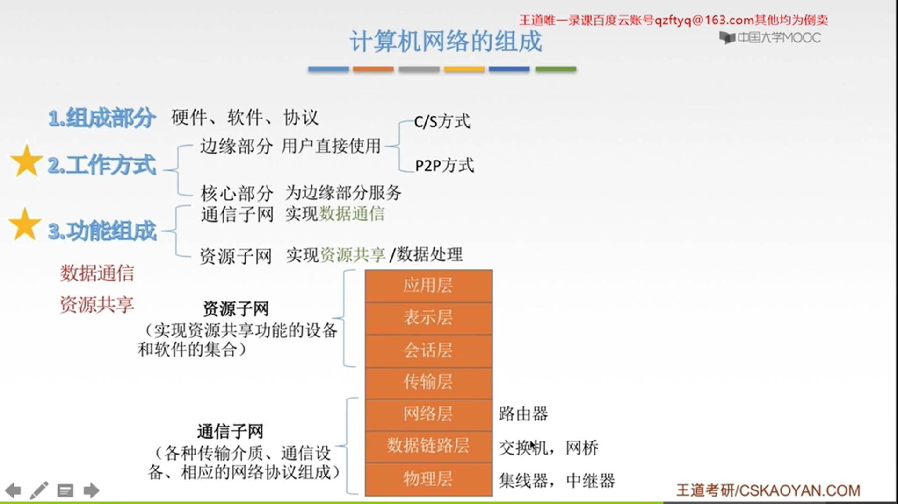
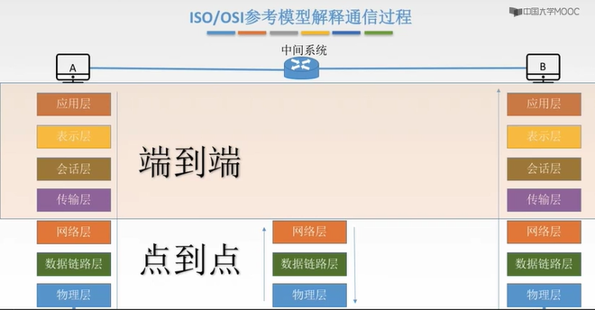

> 2019.05.23

#### 1.1 计算机网络概述
##### 1.1.1 计算机网络整体架构
- 计算机网络的组成

- 计算机网络的分类
    - 按分布范围：广域网LAN（交换技术）、城域网MAN、局域网WAN（广播技术）、个人区域网PAN
    - 按使用者分：公用网、专用网
    - 按交换技术分：电路交换、报文交换、分组交换
    - 按拓扑结构分：总线型、星型、环型、网状型
    
    - 按传输技术分：广播式网络（共享公共通信信道）、点对点网络（使用分组存储转发和路由选择机制）
##### 1.1.2 标准化工作及组织

##### 1.1.3 性能指标

###### 速率（数据传输率或比特率）

- 在数字信道上传送数据位数的速率
- 速率单位：b/s,kb/s,Mb/s,Gb/s,Tb/s
- `注意B和b的区别1B=8bits`
- 换算单位：速率10^3 存储容量2^10
- Byte通常用来表示存储容量
###### 带宽

- 用来表示网络的通信线路传送数据的能力，带宽是指单位时间内从计算机网络中的某一点到另一点所能通过的`最高数据率`（从**发送端**发送数据的最高速率而不是在链路上的传输速率）
###### 吞吐量

- 单位时间内通过某个网络（或信道、接口）的数据量，吞吐量受网络的带宽或网络的额定速率的限制
###### 时延

- 数据从网络的一端传送到另一端所需的时间，也叫做延迟或迟延（单位s）
- 传输时延：从发送端将数据的所有bit推送到信道上所需的时间（数据长度/信道带宽）
- 传播时延：从起始位置到路由器的传播时间（信道长度/电磁波在信道上的传播速度）
- 排队时延：等待输出或输入链路时间
- 处理时延：对数据进行检错、并根据数据找出口将数据传出去
- **高速链路**：提高信道带宽，减少发送时延
###### 时延带宽积

- 时延带宽积(bit) = 传播时延(s)*带宽(b/s)
- 以比特为单位的链路长度
###### 往返时延RTT

- 从发送方发送数据开始，到发送方收到接收方的确认（接收到数据后立即发送确认）总共经历的时延（不包括发送时延）包括`传播时延`*2+末端处理时间（接收方对数据进行处理之后再发送确认，一般是忽略不计的）
###### 利用率
- 信道利用率：有数据通过时间/（有/无）数据通过实践
- 网络利用率：信道利用率加权平均值
#### 1.2 计算机网络整体架构
##### 分层结构

**为什么要分层->将大问题分解成很多个小问题来解决 分层结构（按功能）**

- 实体
> 第n层中的活动元素称为n层实体，同一层的实体叫做对等实体
- 协议
> 对等实体之间才有协议，包括语法（格式）、语义（功能）、同步（顺序）
- 接口
> 上层使用下层服务的入口
- 服务
> 下层为相邻上层提供的功能调用，服务的具体细节对上一层完全屏蔽
##### 计算机网络分层
- 7层OSI（法定标准）
- 4层TCP/IP（事实标准）
- 5层的体系结构（学习专用）
###### ISO/OSI参考模型
- 支持异构网络及系统的互联互通（ISO于1984年提出）

- 应用层->表示层->会话层->传输层->网络层->数据链路层->物理层
- （物联网淑惠试用）
- 上三层端到端，下三层点到点
- **中间系统（如路由器）是网络层：需要提取IP地址得到路由信息**

- 应用层
    > 所有能和用户交互产生网络流量的程序（HTTP、FTP、SMTP等协议）
- 表示层
    > 用于处理在两个通信系统中交换信息的表示方式（语法和语义）
    - 数据格式变换、数据加密解密、数据压缩和恢复（JPEG等协议）
- 会话层
    > 向表示层实体/用户进程提供建立连接并在连接上有序地传输数据，会话之间彼此独立（如ASP等协议）
    - 建立、管理、终止会话、使用校验点使会话在通信失效时从校验点/同步点继续恢复通信，实现数据同步（如传输大文件）
- 传输层
    > 主机中两个进程的通信，即端到端（端口）的通信，传输单位是报文段或用户数据报
    - 可靠传输（TCP）、不可靠传输（UDP）、差错控制、流量控制（控制发送方的速度）、复用分用（复用：多个应用层进程可同时使用下面运输层的服务；分用：运输层把收到的信息分别交付给上面应用层中相应的进程）
- **网络层**
    > 把分组从源端到目的端，为分组交换网上的不同主机提供通信服务，网络层运输单位是数据报（数据报过长会进行分组）（IP、ARP、ICMP等协议）
    - 路由选择、流量控制、差错控制（奇偶校验码等）、拥塞控制（和流量控制只控制发送方的发送速率不同，它是全局性的）
- 数据链路层
    > 把网络层传下来的数据包组装成帧（STP、SDLC等协议）
    - 成帧、差错控制（帧错+位错）、流量控制、访问（接入）控制（对共享信道的访问进行控制）
- 物理层
    > 在物理媒体上实现比特流的透明传输（不管所传数据是什么样的比特组合，都应当能够在链路上传送），单位是比特（Rj54、802.3等协议）
    - 定义接口特性（如引脚接入方式等）、定义传输模式（单工、双工、半双工）、定义传输速率、比特同步（利用时钟信号同步）、比特编码（规定哪种电压表示0，哪种表示1）
###### TCP/IP参考模型

- 与OSI模型的相同点
    - 都分层
    - 基于独立的协议栈的概念
    - 可以实现异构网络互联
- 与OSI模型的不同点
    - OSI定义三点：服务、协议、接口
    - OSI先出现，参考模型先于协议发明，不偏向特定协议
    - TCP/IP设计之初就考虑到异构网互联问题，将IP作为重要层次

| |ISO/OSI参考模型|TCP/IP模型|
-|-|-|
|网络层|无连接+面向连接|无连接|
|传输层|面向连接|无连接+面向连接|
###### 5层参考模型
 
 

